# ArenaVerse – System Architecture
## Advanced Implementation, Integration & Validation

---

## 🏛️ System Architecture Overview

ArenaVerse is an enterprise-grade eSports tournament management, AI creative engine, and interactive gaming community platform. For end-to-end interactive flowchart diagrams of all user and platform workflows, see [docs/workflow_diagram.md](file:///d:/College/Semester%207/UDP/ArenaVerse/docs/workflow_diagram.md). This architecture document represents the complete production implementation following the integration of real-time communication, WebRTC voice channels, Gemini AI, automated anti-cheat, payment wallets, streaming directories, and Kubernetes orchestration.

---

## 📊 Complete System Flow & Component Diagram

```mermaid
graph TD
    %% Users Layer
    subgraph UsersLayer["USERS LAYER"]
        U["Users (Players, Organizers, Admins)"]
    end

    %% Frontend Layer
    subgraph FrontendLayer["FRONTEND LAYER (React.js + Vite & PWA Service Worker)"]
        direction TB
        M1["Authentication & User Management"]
        M2["Player & Team Management"]
        M3["Tournament Management"]
        M4["Match & Bracket Management"]
        M5["Recruitment (LFT / LFP)"]
        M6["Rankings & Gamification"]
        M7["Community & Forums"]
        M8["Wallet & Payments"]
        M9["AI Features"]
        M10["Streaming & Replay"]
        M11["Notifications"]
        M12["Admin & Security"]
    end

    %% Backend Layer
    subgraph BackendLayer["MIDDLE BACKEND LAYER"]
        B["Node.js & Express Backend Services"]
    end

    %% Supporting Integrations
    subgraph Integrations["SUPPORTING INTEGRATIONS"]
        SI1["Socket.io (Real-Time Communication)"]
        SI2["WebRTC (Voice & Screen Sharing)"]
        SI3["Gemini AI (AI Features)"]
        SI4["Redis (Caching)"]
        SI5["Payment Gateway (Razorpay)"]
        SI6["External Game APIs (Steam / Riot / Epic)"]
        SI7["Twitch / YouTube (Streaming & Replay)"]
    end

    %% Database Layer
    subgraph DatabaseLayer["CENTRAL PERSISTENT DATABASE"]
        DB[("MongoDB Central Database")]
    end

    %% Infrastructure Layer
    subgraph InfraLayer["DEPLOYMENT & INFRASTRUCTURE LAYER"]
        CICD["GitHub Actions CI/CD"]
        Docker["Docker Containers"]
        Nginx["Nginx Reverse Proxy"]
        K8s["Kubernetes Cluster"]
        Health["System Health Monitoring"]
        Audit["Audit Logs"]
    end

    %% Connections
    U --> FrontendLayer
    FrontendLayer -->|REST API / WebSockets / WebRTC| BackendLayer
    
    BackendLayer <--> SI1
    BackendLayer <--> SI2
    BackendLayer <--> SI3
    BackendLayer <--> SI4
    BackendLayer <--> SI5
    BackendLayer <--> SI6
    BackendLayer <--> SI7

    BackendLayer --> DB

    CICD --> Docker
    Docker --> Nginx
    Nginx --> K8s
    K8s -. Monitored by .-> Health
    K8s -. Logged by .-> Audit
    InfraLayer -. Hosts .-> BackendLayer
```

---

## 🛠️ Module & Integration Breakdown

### 1. Frontend Application Tier (`React.js + Vite`)
* **PWA Service Worker**: Offline caching, asset prefetching, and mobile app-like PWA experience.
* **12 Core Modules**:
  * **Authentication & User Management**: JWT auth, role RBAC (Player, Organizer, Admin), profile settings.
  * **Player & Team Management**: Squad rosters, invite codes, member roles, team chat.
  * **Tournament Management**: Elimination bracket configuration, seeding, fee rules, certificates.
  * **Match & Bracket Management**: Live score updates, check-in timeouts, automated walkover handling.
  * **Recruitment (LFT/LFP)**: Looking for Team / Looking for Player recruitment boards.
  * **Rankings & Gamification**: 7 Competitive Divisions (Bronze to Grandmaster), XP, Battle Pass progression.
  * **Community & Forums**: Discussion categories, community polls, player follow system.
  * **Wallet & Payments**: Arena Coins wallet, Razorpay entry fee deposits, cashouts.
  * **AI Features**: ArenaBot chatbot widget, AI Creative Studio poster generator, match predictor.
  * **Streaming & Replay**: Live Twitch/YouTube stream directory, VOD replay player.
  * **Notifications**: Socket.io real-time alerts, match check-in reminders, follow activity feed.
  * **Admin & Security**: Platform DAU/MAU analytics, anti-smurf investigation console, ban triggers.

---

### 2. Backend & Integration Tier (`Node.js + Express`)
* **Socket.io**: Real-time bracket node advancement, live match scores, room notifications.
* **WebRTC**: Peer-to-peer audio channels and screen share during scrims and tactics planning.
* **Google Gemini AI**: Context-aware AI assistant and creative asset generator.
* **Redis**: Session caching, rate-limiting store, and Socket.io pub/sub adapter.
* **Razorpay Payment Gateway**: Escrow handling for tournament prize pools and deposit verification.
* **External Game APIs**: Steam, Riot Games, and Epic Games ID verification and stats sync.
* **Twitch/YouTube Embeds**: API sync for live creator channels and VOD replays.

---

### 3. Central Persistence Tier (`MongoDB`)
* **MongoDB**: Single source of truth holding 31 schema collections (Users, Teams, Tournaments, Matches, Brackets, ForumPosts, Payments, AntiCheatReports, BattlePass, etc.).

---

### 4. Infrastructure & DevOps Tier
* **Docker**: Containerized micro-services packaging for backend and frontend apps.
* **Nginx**: Edge reverse proxy handling SSL termination and request routing.
* **Kubernetes (k8s)**: Container orchestration, autoscaling, and zero-downtime deployment.
* **GitHub Actions**: Automated CI/CD pipeline running lint checks, builds, and docker pushes.
* **System Health Monitoring & Audit Logs**: Node server health check metrics and security audit logging.
