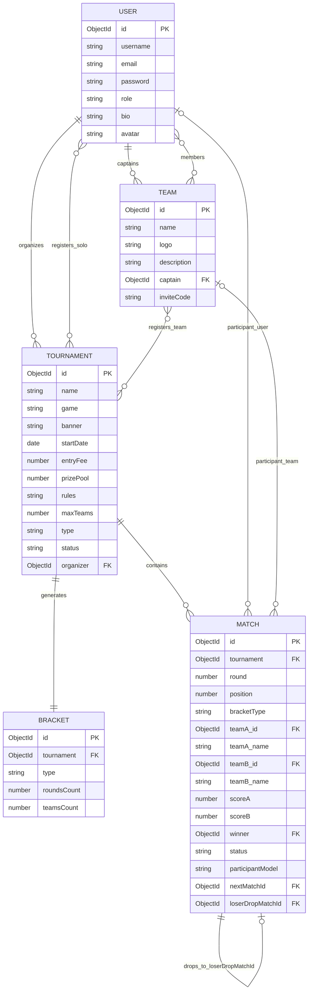

# Entity Relationship (ER) Diagram: Arena-Verse

The following ER diagram describes the entities and associations in the Arena-Verse database.

## Relationships Explained
- **USER & TEAM**: A User can captain 0 or more Teams (`captains`). A User can be a member of multiple Teams (`members`).
- **USER & TOURNAMENT**: An organizer User can create 0 or more Tournaments (`organizes`). A player User can register for 0 or more solo Tournaments (`registers_solo`).
- **TEAM & TOURNAMENT**: A Team can register for 0 or more team Tournaments (`registers_team`).
- **TOURNAMENT & BRACKET**: A Tournament has exactly 1 Bracket associated with it once started (`generates`).
- **TOURNAMENT & MATCH**: A Tournament contains multiple Matches.
- **MATCH SELF-REFERENCE**: A Match can link to another Match (`nextMatchId` and `loserDropMatchId`) to enable automatic progression of the winner and dropping of the loser.
