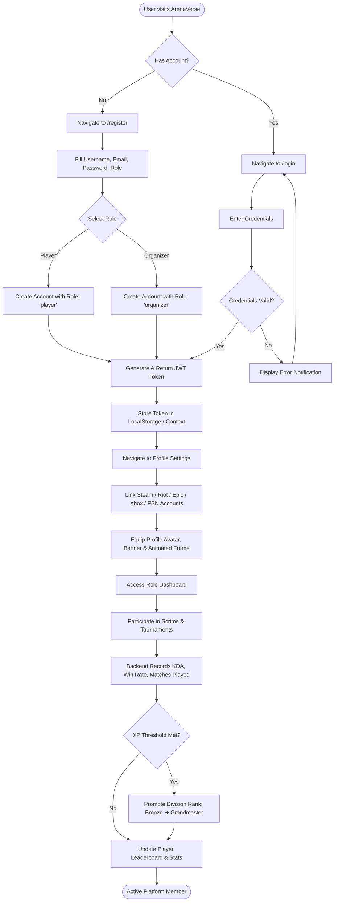
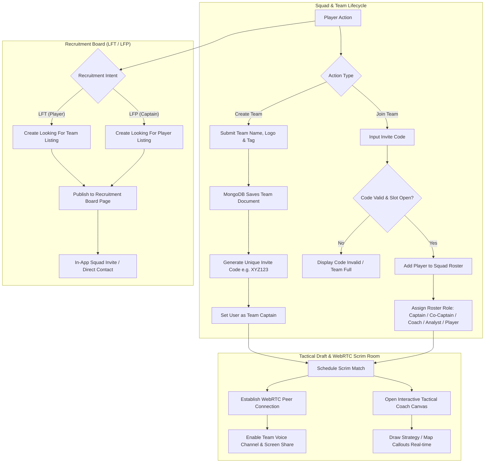
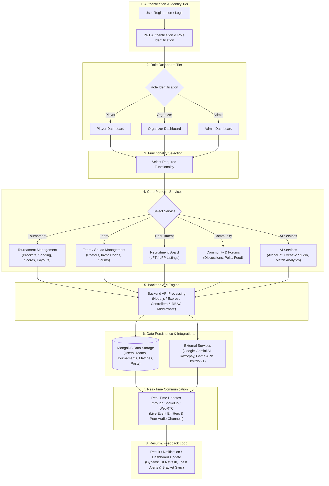
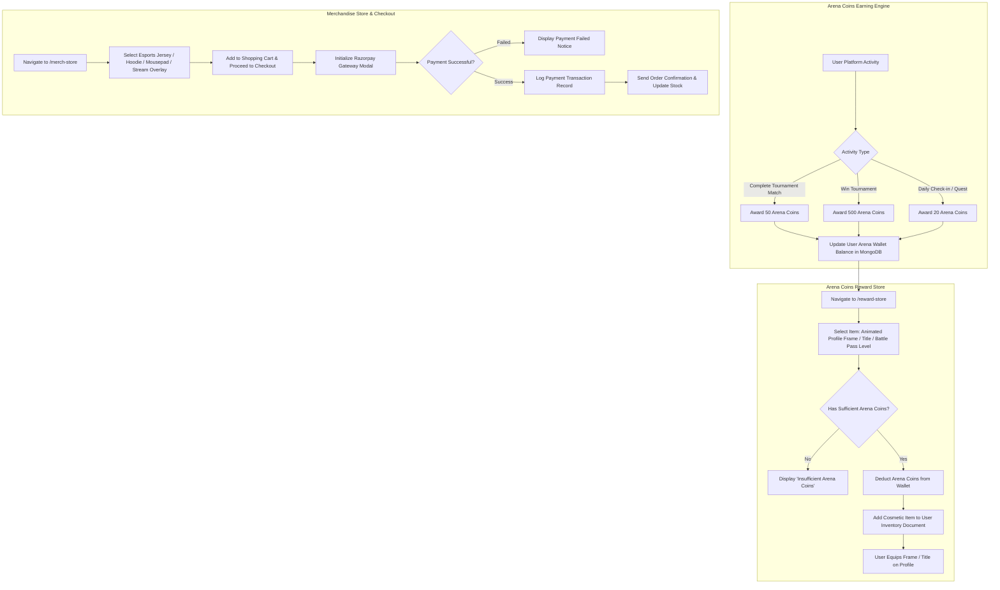
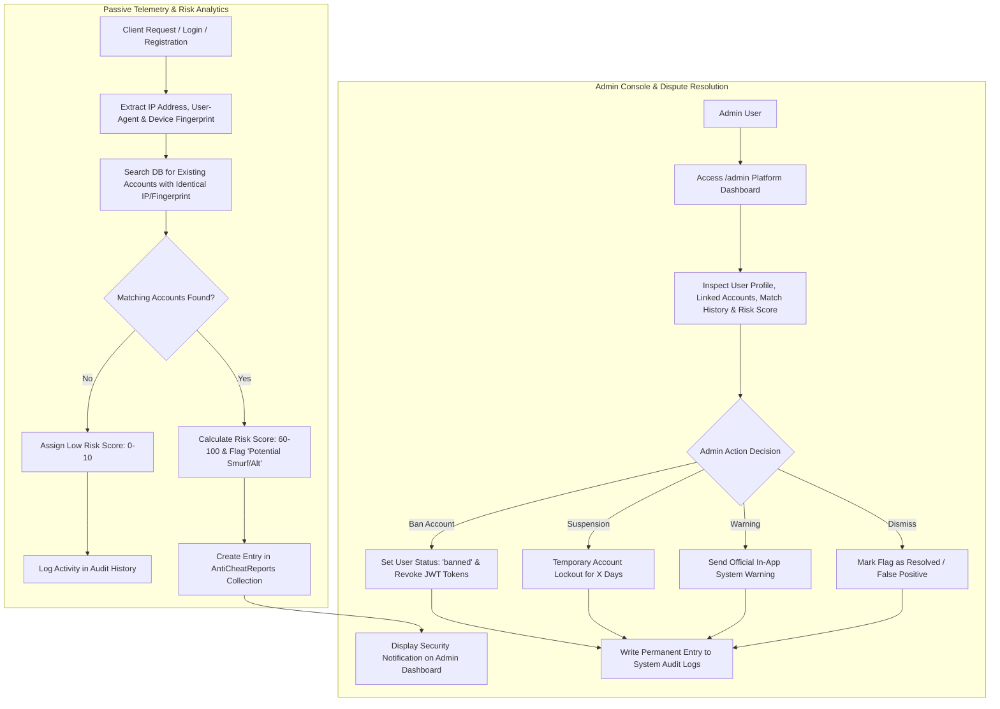
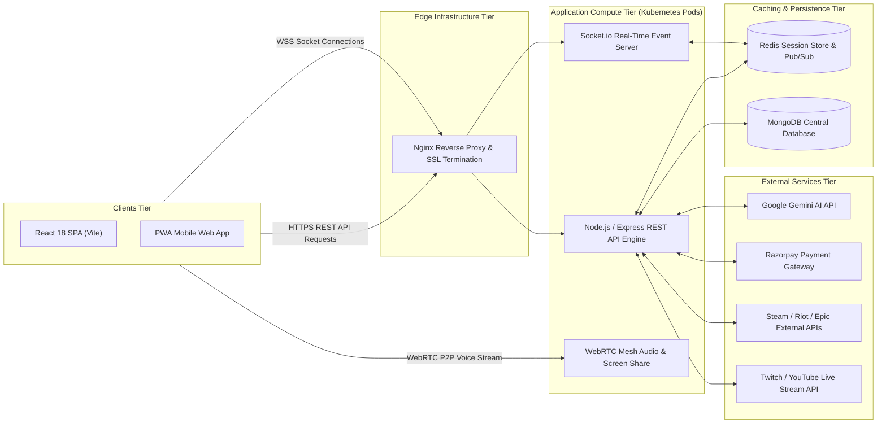

# 🔄 ArenaVerse – Complete Platform Workflows & Interaction Diagrams

This document contains detailed workflow diagrams detailing user journeys, operational logic, real-time data flows, and system interactions across the ArenaVerse eSports Platform.

---

## 1. 👤 User Authentication & Career Lifecycle Workflow

This workflow illustrates how a user registers, selects a role, links game IDs (Steam, Riot Games, Epic, Xbox, PSN), builds their career profile, and earns competitive rankings (Bronze to Grandmaster).

---

## 2. 👥 Team Squad, Recruitment & Scrim Drafting Workflow

This workflow details how players create or join team squads using invite codes, assign tactical roles (Captain, Coach, Analyst, Player), post recruitment listings, and enter WebRTC scrim lobbies with tactical whiteboards.

---

## 3. 🏆 Tournament Setup, Bracket Engine & Match Progression Workflow

This core workflow covers tournament creation by an organizer, player/squad registration, automated double/single elimination bracket generation, match check-in, live score reporting via Socket.io, walkover timers, MVP awards, and PDF certificate generation.

```mermaid
flowchart TD
    subgraph SetupPhase["1. Tournament Creation & Registration"]
        Org[Organizer] --> CreateTourn[Create Tournament: Rules, Max Teams, Entry Fee, Prize Pool]
        CreateTourn --> SaveDraft[Save Tournament Document in Status: 'draft']
        SaveDraft --> PublishTourn[Publish Tournament to Public Directory]
        
        Players[Players / Squad Captains] --> BrowseTourn[Browse Tournament Directory]
        BrowseTourn --> RegisterTourn[Click Register]
        RegisterTourn --> CheckWallet{Check Arena Wallet Balance}
        CheckWallet -- Insufficient --> DepositFunds[Prompt Razorpay Wallet Deposit]
        DepositFunds --> CheckWallet
        CheckWallet -- Sufficient --> DeductFee[Deduct Entry Fee & Lock Slot]
        DeductFee --> RosterConfirmed[Add Team / Player to Tournament Roster]
    end

    subgraph BracketPhase["2. Seed Distribution & Bracket Generation"]
        PublishTourn --> CapacityCheck{Max Participants Reached?}
        RosterConfirmed --> CapacityCheck
        CapacityCheck -- Yes / Start Date Reached --> TriggerBracket[Organizer Triggers Bracket Generation]
        TriggerBracket --> BracketType{Select Bracket Format}
        BracketType -- Single Elimination --> GenSingle[Build Single-Elimination Match Trees]
        BracketType -- Double Elimination --> GenDouble[Build Winner & Loser Bracket Trees]
        GenSingle --> InitMatches[Insert Match Records with nextMatchId & loserDropMatchId]
        GenDouble --> InitMatches
        InitMatches --> UpdateStatus[Set Tournament Status: 'active']
        UpdateStatus --> SocketBroadcast[Socket.io Broadcasts 'bracket_generated' to Clients]
    end

    subgraph MatchPhase["3. Match Execution, Check-In & Score Progression"]
        SocketBroadcast --> MatchStartNotification[Send Match Alert to Assigned Players]
        MatchStartNotification --> MatchCheckIn[Players Click 'Check In' Button]
        MatchCheckIn --> CheckInTimer{Both Checked In within 15 mins?}
        CheckInTimer -- No (No-Show) --> AutoWalkover[Trigger Automated Walkover: Advance Present Team]
        CheckInTimer -- Yes --> LiveMatch[Execute Scrim / Match Play]
        
        LiveMatch --> ReportScore[Organizer / Captain Submits Match Scores]
        ReportScore --> ValidateScore{Score Confirmed?}
        ValidateScore -- Dispute --> AdminReview[Route Match to Dispute Console]
        AdminReview --> ResolveScore[Admin Overrides Score]
        ValidateScore -- Valid --> SaveScore[Save Score & Determine Winner]
        ResolveScore --> SaveScore

        AutoWalkover --> SaveScore
        SaveScore --> ProgressEngine[Backend Bracket Progression Engine]
        ProgressEngine --> AdvanceWinner[Set Winner in nextMatchId Slot]
        ProgressEngine --> DropLoser{Is Double Elimination?}
        DropLoser -- Yes --> DropToLosers[Set Loser in loserDropMatchId Slot]
        DropLoser -- No --> Eliminate[Mark Player / Team Eliminated]
        
        AdvanceWinner --> SocketLiveScore[Socket.io Emits 'match_updated' Event]
        SocketLiveScore --> RefreshUI[Live Bracket Updates Dynamically on Client]
    end

    subgraph RewardPhase["4. MVP Award, PDF Certificates & Payout"]
        RefreshUI --> FinalsCheck{Is Tournament Final Match?}
        FinalsCheck -- No --> MatchStartNotification
        FinalsCheck -- Yes --> DeclareChampion[Declare Tournament Champion & Runner-Up]
        DeclareChampion --> SelectMVP[Organizer Selects Match & Tournament MVPs]
        SelectMVP --> DistributePrize[Transfer Prize Pool to Winner Wallet]
        DistributePrize --> GenPDF[PDFKit Streaming Engine Generates PDF Certificates]
        GenPDF --> DownloadCert[Certificates Available in '/my-certificates']
        DownloadCert --> CompleteTourn([Tournament Status: 'completed'])
    end
```

---

## 3.5 🔄 System Workflow

This workflow details the sequential architecture processing pipeline, moving from user authentication and role-based dashboard redirection, through core platform service execution, backend API processing, database persistence, and real-time Socket.io/WebRTC event broadcasting back to the client interface.

---

## 4. 🤖 AI Creative Studio, Chatbot & Tactical Analytics Workflow

This workflow illustrates how Gemini AI integrates with MongoDB context to drive the floating ArenaBot chatbot, generate promotional assets in the AI Creative Studio, and calculate live win probabilities & draft recommendations.

```mermaid
flowchart TD
    subgraph ArenaBotFlow["ArenaBot Chatbot Assistant"]
        UserQuery[User types query in ArenaBot Floating Widget] --> FetchContext[Backend fetches User, Team & Tournament Context from MongoDB]
        FetchContext --> ConstructPrompt[Construct System Prompt + Live DB Payload]
        ConstructPrompt --> CallGeminiBot[Invoke Google Gemini 1.5 API]
        CallGeminiBot --> StreamResponse[Stream Markdown Response back to Widget UI]
    end

    subgraph CreativeStudioFlow["AI Creative Studio Asset Generator"]
        OrganizerUser[Organizer / Player] --> SelectAssetType{Select Creative Asset}
        SelectAssetType -- Tournament Poster --> PosterForm[Input Event Title, Game, Date & Color Theme]
        SelectAssetType -- Team Logo --> LogoForm[Input Team Tag, Mascot & Style]
        SelectAssetType -- Rulebook / Proposal --> RuleForm[Input Rules Summary & Sponsor Targets]
        
        PosterForm --> GeneratePrompt[Format AI Creative Prompt]
        LogoForm --> GeneratePrompt
        RuleForm --> GeneratePrompt

        GeneratePrompt --> CallGeminiStudio[Send Request to Gemini API / Asset Renderer]
        CallGeminiStudio --> ReturnAsset[Return Generated Visual Poster, Banner, SVG Logo or Markdown Text]
        ReturnAsset --> RenderStudioUI[Display Asset Preview & Download Button]
    end

    subgraph MatchAnalyticsFlow["AI Match Predictor & Draft Coach"]
        SelectMatch[Select Upcoming Match Node] --> GatherHistoricalData[Gather Teams' Historical Win Rate, KDA & Map Stats]
        GatherHistoricalData --> MLPredictor[Calculate Win Probability % & Key Matchups]
        MLPredictor --> DraftAdvice[Generate Recommended Pick/Ban Draft Recommendations]
        DraftAdvice --> RenderMatchBadge[Display AI Prediction Widget on Match Card]
    end
```

---

## 5. 🛍️ Arena Coins, Rewards Store & Merchandise Workflow

This workflow shows how users acquire Arena Coins through tournament participation and daily quests, spend them in the Reward Store for digital cosmetics, or purchase physical/digital merchandise.

---

## 6. 🛡️ Anti-Cheat, Anti-Smurf & Admin System Operations Workflow

This workflow details the automated security telemetry, duplicate account detection, risk score calculation, and admin operational tools.

---

## 7. 🌐 End-to-End Real-Time Data & System Infrastructure Flow

This architecture flow illustrates how client requests traverse Nginx, Kubernetes, Node.js/Express, Redis, Socket.io, WebRTC, MongoDB, and External APIs.

